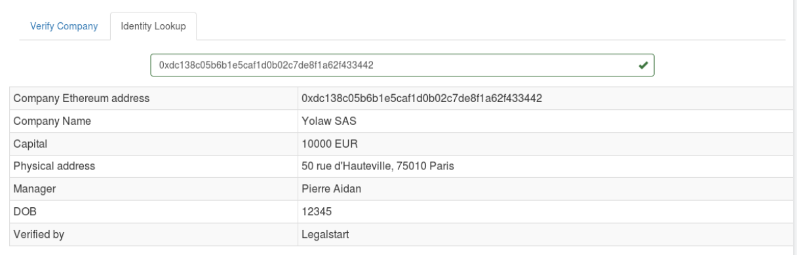

# Introduction

## Proceedings from a hackathon

Making software that opens law up

With fellow @onyb @ Legalstart

## Incorporation is a closed process

Observed in France

## Open it up

Taking lesson from open-source, open data initiatives and public blockchains

# 🏛️ Incorporating today

With the example of France

## Tedious & closed process

## Entirely owned by Greffes

State designated entities

# `> Company()`

## Base attributes

Associates, capital and a common goal

=>

```
Company = { Name,
            [AssociatePerson],
            CapitalAmount
            }
```

## To be identifyable on a blockchain

```
Company = { Name,
            [AssociatePerson],
            CapitalAmount,
            EthereumAddress
            }
```

## Recording on a blockchain

Companies are recorded in the main Opengreffe record

## The process

1. Associates: setup multisig addr + submit to Opengreffe
2. Verifyer: due-diligence and approval => 👶
3. Other business: lookup the company on Opengreffe

## Step 1&2 - add a company


## Step 3 - look it up



## What this allows

- identification of company with Ethereum address
- building long-term trust
- accountability of associates

## Does it work legally

Yes, under Articles 1832 and 1871, using "Société en Participation"

(but unlimited liability and no moral entity)

# 👍 How good

## Open a closed system

And replace a monopoly!

## More auditable and secure

Processes that are moved on-chain are more easily auditable and can be
verifyably safe

Moving more of the due diligence process on-chain would be interesting

## On-chain business

Ethereum addr `->` Company

## Allow innovation

Open-up discussion on the rules of company creation process

# 👋 Conclusion

## Open source law (ish)

One more attempt to move concepts managed by law into code

(and bring open-source goodness to it)

## Feedback

In search for feedback, ideas

[github.com/lajarre/opengreffe](github.com/lajarre/opengreffe)
